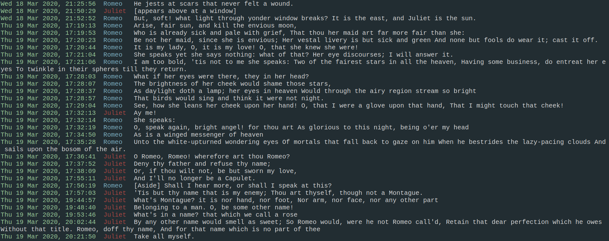
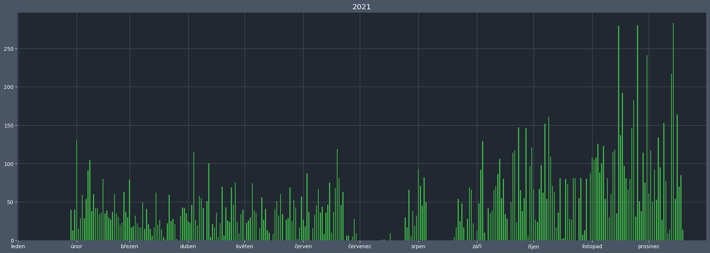

# termess

* [Usage](#usage)
   * [Step 0: Help](#step-0-help)
   * [Step 1: Prepare](#step-1-prepare)
   * [Step 2: Repair](#step-2-repair)
   * [Step 3: Generate](#step-3-generate)
      * [3.1: All chats](#31-all-chats)
      * [3.2: One chat](#32-one-chat)
   * [Step 4: Enjoy](#step-4-enjoy)
   * [Notes](#notes)
* [Example scripts](#example-scripts)
* [GRAPHS](#graphs)
* [TODO](#todo)


---
Facebook provides a way to download all of user's Messenger activities in JSON format. However, each chat is represented by multiple, bad-encoded files

Make analysis of your Messenger communication easier and more comfortable by transforming all those files into a single plain text file with one message per line

Enables very fast and convenient searching through conversations

Files are formatted to be terminal-friendly and intended for use with terminal tools, but potentially (thanks to [simple output](#notes)) usable anywhere else




---
## <div align="center">Usage</div>  
### Step 0: Help
```
$ termess.sh -h
```
Shows list of all availible options and their description

### Step 1: Prepare
```
$ termess.sh -p "path_to_zip_archive"
```
In your current working directory:

* unzips facebook archive
* creates *facebook* folder where:
    * puts all JSON files into *messages* folder
    * puts left over folders with media into *media* folder
    * prepares folder *PROCESSED* for final files

**Skipping this step will cause the rest of script to fail!**

### Step 2: Repair
```
$ termess.sh -r
```
Uses included Ruby script to repair bad encoding of JSON files provided by Facebook

termess will try to search for repair script in the same directory *termess.sh* is. If not found, user is prompted to enter custom path interactively

**Skipping this step can cause messages will not be displayed correctly!**

### Step 3: Generate
#### 3.1: All chats
```
$ termess.sh -a
```
or
```
$ termess.sh -a "path_to_dir_where_files_will_be_generated"
```
Creates final files that are ready for further use of your choice

When called without argument, termess will generate files in your current working directory (after your confirmation)

You can use folder *facebook/PROCESSED* to save all your final files

#### 3.2: One chat
```
$ termess.sh -f "path_to_one_chat_folder"
```
Processes just one particular chat

In this case output is only displayed on stdout, but can be redirected to a file by yourself

### Step 4: Enjoy
Now you have everything prepared for your Messenger communication analysis to begin

### Notes

* All steps can be done with a single command:
```
$ termess.sh -p <facebook.zip> -r -a facebook/PROCESSED
```
* Once `-p` and `-r` are executed successfully, they are not needed anymore. You can run the script with just `-a` or `-f` option after that
* For simple output without colors and alignment, use `-sa` or `-sf` instead ('s' has to be always first)


---
## <div align="center">Example scripts</div>  
After you have got your chats processed, you can use example scripts in `data_analysis` folder to analyse the chats and obtain some interesting information


---
## <div align="center">GRAPHS</div>  
GRAPHS module in `GRAPHS` folder lets you generate fancy graphs that display total number of either messages, or words sent in given chat per each day

Python script `generate.py` is called by wrapper bash script `GRAPHS.sh`

The wrapper script has 2 arguments
   - path to a folder containig (some of) the chat files created with the `termess` utility
   - mode option: `1` for **messages**, `2` for **words**

Example call of the script is:
```
$ /GRAPHS.sh "$HOME/Documents/facebook/PROCESSED/" 1
```




---
## <div align="center">TODO</div>  

* display some information about sent files, gifs, links, etc. rather than just "null"
* message reactions
* better newline handling
* fix parsing problem of some chats
